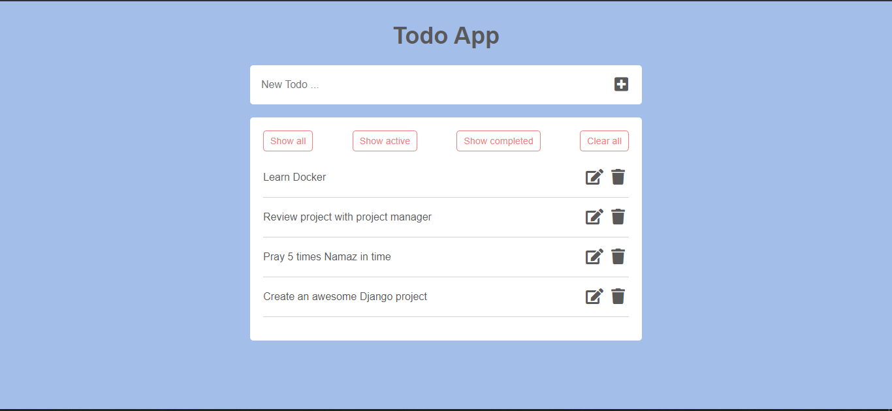

<!--
*** Thanks for checking out one of my first django + react repos. If you want to contribute, 
*** notify me with opening issue here. I'll be so glad to hear that. Check my other repos, 
*** it'll be useful if you are a beginner, junior and middle developers. Thank you again one 
*** more time. 
-->

[![Contributors][contributors-shield]][contributors-url]
[![Forks][forks-shield]][forks-url]
[![Stargazers][stars-shield]][stars-url]
[![Issues][issues-shield]][issues-url]
[![Twitter][twitter-shield]][twitter-url]
[![LinkedIn][linkedin-shield]][linkedin-url]

<!-- Project Overview -->

    <h3 align="center">Best-README-Template</h3>

    
    

